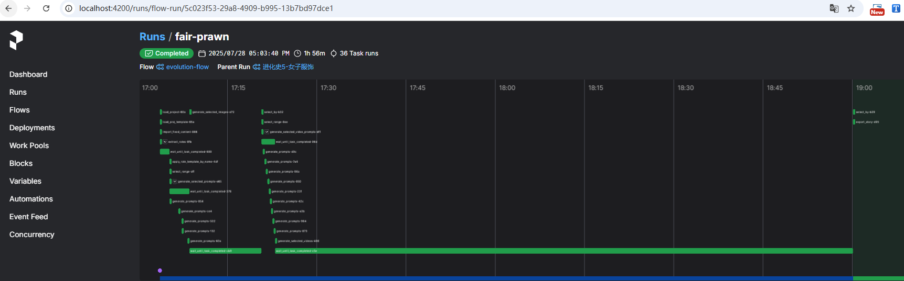
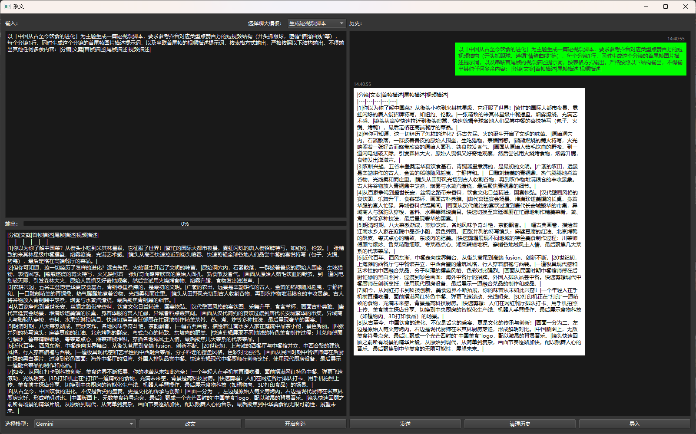
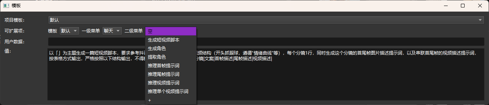
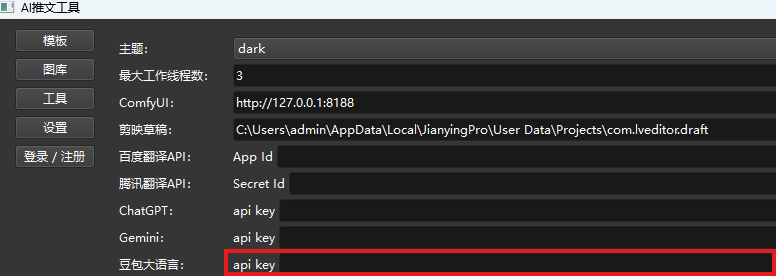
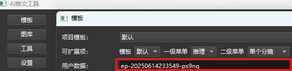
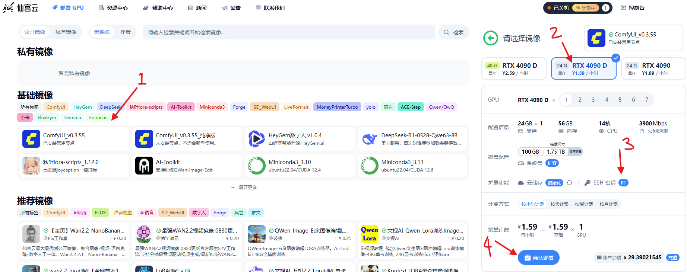
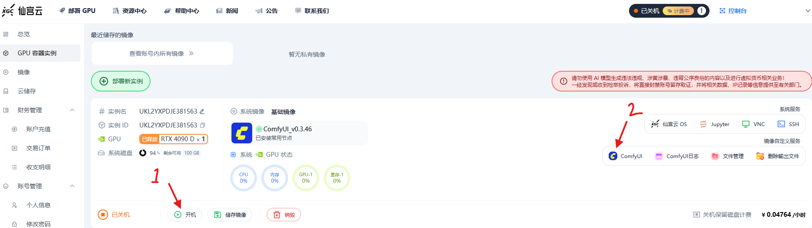
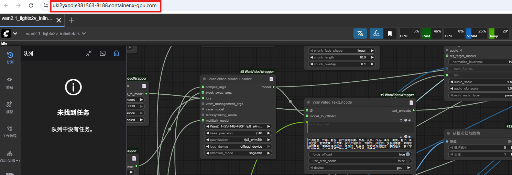
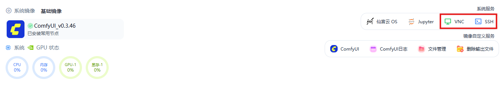
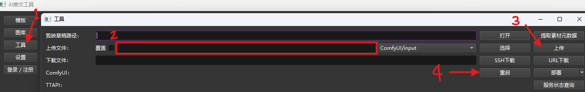

# Tweets
一句话概之：披着推文工具外壳的全能AI扩展坞！

    

  <video src="https://github.com/user-attachments/assets/3f23f980-c635-431a-8cbd-c18fe96dc317" width="70%" controls> </video>

---

## 特色
- 可视化界面编辑与工作流无缝衔接
  本地运行的工作流，轻量便捷，再也不用担心被Coze、n8n、Dify掐脖子😜
  
- 一个软件搞定短视频，内置聊天界面，再也不用为了剪辑短视频来回切换各种网页或软件
  
- 全流程打通，操作便捷（从文案->口播/字幕->画面->视频->对口型->音效->背景音乐）
- 支持一键导出剪映草稿
- 高度模块化、支持自由定制（提示词模板、角色模板、剪映模板）
  
- 支持角色固定和多角色配音
- 支持 Win & Mac 平台

## 快速开始
1. 从[Releases](https://github.com/chaolunner/Tweets/releases/latest)下载最新版本
2. 解压并点击 **launch.exe** 启动
3. 部署豆包 / DeepSeek 大语言模型 -> 登录[火山引擎](https://www.volcengine.com/docs/82379/1494384) -> 创建[API Key](https://console.volcengine.com/ark/region:ark+cn-beijing/apiKey) -> [开通模型](https://console.volcengine.com/ark/region:ark+cn-beijing/openManagement) -> 创建[自定义推理接入点](https://console.volcengine.com/ark/region:ark+cn-beijing/endpoint)
4. 复制 **API Key** 到：设置 -> 豆包大语言
   
5. 复制 **自定义推理接入点** 替换：模板 -> 用户数据
   
6. 部署海螺配音 -> 登录[MINIMAX平台](https://platform.minimaxi.com/user-center/basic-information/interface-key)创建新的密钥 -> 跳转[账户信息](https://platform.minimaxi.com/user-center/basic-information)获取groupID
7. 复制 **groupID** 到：设置 -> 海螺 -> Group ID, 复制 **密钥** 到：设置 -> 海螺 -> api key
8. 部署ComfyUI -> 登录[仙宫云](https://www.xiangongyun.com/console/user/sshkey)添加SSH密钥 -> 部署 **基础ComfyUI镜像** 并选择刚才添加的SSH
   
9. 切到[GPU 容器实例](https://www.xiangongyun.com/console/instance) -> 打开 ComfyUI 网页 -> 复制网页链接 -> 粘贴到：设置 -> ComfyUI
   
   
   
10. 拓展：快速上传模型和重启ComfyUI
    - 打开VNC复制网页链接 -> 粘贴到：设置 -> 仙宫云SSH -> 连接主机
    - 点击SSH复制端口 -> 粘贴到：设置 -> 仙宫云SSH -> 端口
      
    - 将前面创建的SSH密钥路径粘贴到：设置 -> 仙宫云SSH -> 私钥路径
    - 使用 **工具** 上传模型和重启ComfyUI
      
11. 部署豆包语音识别 -> [创建应用](https://console.volcengine.com/speech/app) -> 开通[流式语音识别](https://console.volcengine.com/speech/service/16)和[流式语音识别大模型](https://console.volcengine.com/speech/service/10011) -> 复制 **Access Token** 和 **Cluster ID** -> 粘贴到：设置 -> 豆包语音

### 启动工作流
1. 点击 **workflow.exe** 启动

### 其他模块
供应商|模块|创建密钥
-|-|-
OpenAI|ChatGPT|[API keys](https://platform.openai.com/api-keys)
谷歌|Gemini|[API 密钥](https://aistudio.google.com/app/apikey)
Vidu|Vidu|[API Key 管理](https://platform.vidu.cn/api-keys)
TTAPI|Midjourney|[TTAPI KEY](https://dashboard.ttapi.io/dashboard/overview)
-|Midjourney Video|
-|Luma|
-|Suno|
runway|runway|[API Keys](https://dev.runwayml.com)
百度|翻译|[密钥](https://api.fanyi.baidu.com/api/trans/product/desktop)
腾讯|翻译|[密钥](https://console.cloud.tencent.com/cam/capi)

## 功能
支持|接入1|接入2|接入3|接入4|接入5|接入6|接入7|接入8|接入9
-|-|-|-|-|-|-|-|-|-
大语言模型|豆包✅️|DeepSeek✅️|ChatGPT✅️|Gemini✅️
ComfyUI|本地✅️|仙宫云✅|Liblib✅
文生图|Flux.1✅️|Qwen-Image✅️|Midjourney✅️|豆包Seedream4✅️|Gemini✅️|海螺✅️|Runway✅
图生图|Flux.1✅️|豆包Seedream4✅️|Vidu✅️|Gemini✅️|海螺✅️|Runway✅
图片编辑|Flux Kontext✅️|Qwen-Image-Edit✅️|豆包SeedEdit3.0✅️
文生视频|豆包Seedance✅️|Luma✅️|Veo3✅️|海螺✅️
图生视频|Wan2.1 / Wan2.2✅️|豆包Seedance✅️|Midjourney Video✅️|Luma✅️|Vidu✅️|Veo3✅️|海螺✅️|Runway✅|可灵❓未验证
首尾帧|Wan2.1 / Wan2.2✅️|豆包Seedance✅️|Midjourney Video✅️|Luma✅️|Vidu✅️|海螺✅️
参考生视频|Wan2.1✅️|Vidu✅️|海螺✅️
对口型|InfiniteTalk视频+声音✅️|Sonic图片+声音✅️|Vidu✅️
动作模仿|Wan2.1✅️|Runway✅
语音识别|豆包✅
配音|海螺✅️|豆包✅️
音效|MMAudio✅️
音乐|Suno✅️|豆包✅️|ACE-Step✅️
翻译|大语言模型✅️|百度✅️|腾讯✅️