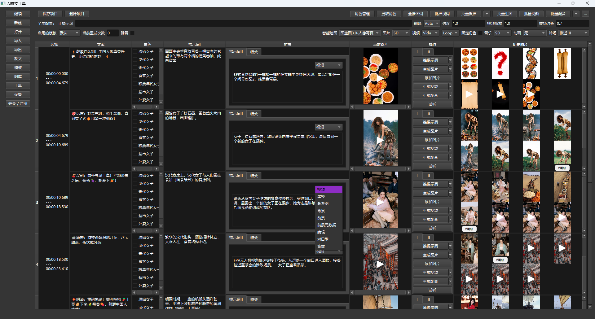

# 介绍
一句话概之：披着推文工具外壳的全能AI扩展坞！

## 特色
- 可视化界面编辑与工作流无缝衔接
  
  本地运行的工作流，轻量便捷，再也不用担心被Coze、n8n、Dify掐脖子😜
  
- 一个软件搞定短视频，内置聊天界面，再也不用为了剪辑短视频来回切换各种网页或软件
  
- 全流程打通，操作便捷（从文案->口播/字幕->画面->视频->对口型->音效->背景音乐）
- 支持一键导出剪映草稿
- 高度模块化、支持自由定制（提示词模板、角色模板、剪映模板）
  
- 支持角色固定和多角色配音
- 支持 Win & Mac 平台

## 功能
支持|接入1|接入2|接入3|接入4|接入5|接入6
-|-|-|-|-|-|-
大语言模型|豆包✅️|DeepSeek✅️|ChatGPT✅️|Gemini✅️|Claude❌|通义千问❌
ComfyUI|本地✅️|仙宫云✅|Liblib✅
文生图|Flux.1✅️|Qwen-Image✅️|Midjourney✅️|豆包✅️
图生图|Flux.1✅️|豆包✅️
图片编辑|Flux Kontext✅️|Qwen-Image-Edit✅️
图生视频|Wan2.1 / Wan2.2✅️|豆包Seedance✅️|Midjourney Video✅️|Luma✅️|Vidu✅️|可灵❓未验证
首尾帧|Wan2.1 / Wan2.2✅️|豆包Seedance✅️|Midjourney Video✅️|Luma✅️|Vidu✅️
参考生视频|Wan2.1✅️|Vidu✅️
对口型|InfiniteTalk视频+声音✅️|Sonic图片+声音✅️
动作模仿|Wan2.1✅️
音效|MMAudio✅️
配音|海螺✅️|豆包✅️|Kokoro✅️
音乐|Suno✅️|豆包✅️|ACE-Step✅️
翻译|大语言模型✅️|百度✅️|腾讯✅️
