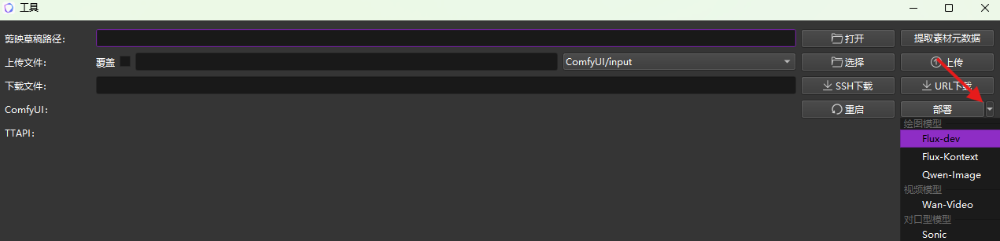

    

    

  <video src="https://github.com/user-attachments/assets/3f23f980-c635-431a-8cbd-c18fe96dc317" width="70%" controls> </video>

---

## 核心优势

    

## 特色
- 可视化界面编辑与工作流无缝衔接
  
- 一个软件搞定短视频，内置聊天界面，再也不用为了剪辑短视频来回切换各种网页或软件
  
- 全流程打通，操作便捷（从文案->口播/字幕->画面->视频->对口型->音效->背景音乐）
- 支持一键导出剪映草稿
- 高度模块化、支持自由定制（提示词模板、角色模板、剪映模板）
  
- 支持角色固定和多角色配音
- 支持 Win & Mac 平台

## 快速开始
1. 从[Releases](https://github.com/chaolunner/Tweets/releases/latest)下载最新版本
2. 解压并点击 **launch.exe** 启动
3. 部署豆包 / DeepSeek 大语言模型 -> 登录[火山引擎](https://www.volcengine.com/docs/82379/1494384) -> 创建[API Key](https://console.volcengine.com/ark/region:ark+cn-beijing/apiKey) -> [开通模型](https://console.volcengine.com/ark/region:ark+cn-beijing/openManagement) -> 创建[自定义推理接入点](https://console.volcengine.com/ark/region:ark+cn-beijing/endpoint)
4. 复制 **API Key** 到：设置 -> 豆包大语言
   
5. ~~复制 **自定义推理接入点** 替换：模板 -> 用户数据~~

   
6. 部署海螺配音 -> 登录[MINIMAX平台](https://platform.minimaxi.com/user-center/basic-information/interface-key)创建新的密钥 -> 跳转[账户信息](https://platform.minimaxi.com/user-center/basic-information)获取groupID
7. 复制 **groupID** 到：设置 -> 海螺 -> Group ID, 复制 **密钥** 到：设置 -> 海螺 -> api key
8. 部署ComfyUI -> 登录[仙宫云](https://www.xiangongyun.com/console/user/sshkey)添加SSH密钥 -> 部署 **基础ComfyUI镜像** 并选择刚才添加的SSH
   
9. 切到[GPU 容器实例](https://www.xiangongyun.com/console/instance) -> 打开 ComfyUI 网页 -> 复制网页链接 -> 粘贴到：设置 -> ComfyUI
   
   
   
10. 拓展：快速上传模型和重启ComfyUI
    - 打开VNC复制网页链接 -> 粘贴到：设置 -> 仙宫云SSH -> 连接主机
    - 点击SSH复制端口 -> 粘贴到：设置 -> 仙宫云SSH -> 端口
      
    - 将前面创建的SSH密钥路径粘贴到：设置 -> 仙宫云SSH -> 私钥路径
    - 使用 **工具** 上传模型和重启ComfyUI
      
11. 部署豆包语音识别 -> [创建应用](https://console.volcengine.com/speech/app) -> 开通[流式语音识别](https://console.volcengine.com/speech/service/16)和[流式语音识别大模型](https://console.volcengine.com/speech/service/10011) -> 复制 **Access Token** 和 **Cluster ID** -> 粘贴到：设置 -> 豆包语音

### 启动工作流
1. 点击 **workflow.exe** 启动
2. 浏览器输入 http://localhost:4200 访问

### 快速入门 —— 批量工作流（故事机）
1. 跑通一个项目
    
2. 保存项目成为模板
    
3. 启动工作流
    
4. 运行批量工作流
    

    

### 其他模块
供应商|模块|创建密钥
-|-|-
OpenAI|ChatGPT|[API keys](https://platform.openai.com/api-keys)
谷歌|Gemini|[API 密钥](https://aistudio.google.com/app/apikey)
Vidu|Vidu|[API Key 管理](https://platform.vidu.cn/api-keys)
TTAPI|Midjourney|[TTAPI KEY](https://dashboard.ttapi.io/dashboard/overview)
-|Midjourney Video|
-|Luma|
-|Suno|
runway|runway|[API Keys](https://dev.runwayml.com)
百度|翻译|[密钥](https://api.fanyi.baidu.com/api/trans/product/desktop)
腾讯|翻译|[密钥](https://console.cloud.tencent.com/cam/capi)
智谱|BigModel|[API keys](https://docs.bigmodel.cn)

### 本地部署 ComfyUI
1. 百度云下载「ComfyUI基础包」链接: https://pan.baidu.com/s/1TzGj-NuPBD4h5uUwNQP7Dw?pwd=ib4k 提取码: ib4k
2. 解压基础包，返回软件 -> 设置 -> ComfyUI(本地) -> 安装路径中填写解压后的路径
3. 工具 -> ComfyUI -> 部署 -> 选择要使用的模块进行下载

    
4. 等待下载完成后刷新ComfyUI页面

### Sora2
1. 浏览器访问：https://chatgpt.com/api/auth/session 获取accessToken
2. 打开软件 -> 设置 -> Sora -> 添加账号
3. 视频模型选择 -> Sora2

### Sora 去水印
1. 下载并解压：**tweets-extension.zip**
2. 将 tweets-extension 放到与 Tweets-Windows-x64 同级目录
3. 点击 install.bat 安装

### Nana Banana 玩法
_注意：需要先配置谷歌[API 密钥](https://aistudio.google.com/app/apikey) 或者 [TTAPI KEY](https://dashboard.ttapi.io/dashboard/overview)_
1. 提示词栏中「右键」菜单快速选择一种玩法
2. 操作栏中 -> 点击「添加图片」 -> 在「历史图片」栏中点击该图片将该图片设置到「当前图片」栏
3. 操作栏中 -> 点击「文生图片」右侧的下拉箭头 -> 选择「参考生图」
    
    
	
### OpenPose 玩法
1. 在「历史图片」栏中选中两张人物图，先选中的一张作为姿势参考图，后选中的一张作为角色形象参考图 -> 右键菜单 -> 图片编辑 -> 点击「真实人物姿势图 + 参考图」
2. 操作栏中 -> 点击「添加图片」 上传一张OpenPose骨架图，在「历史图片」栏中先选中这张骨架图，再按住「Ctrl键」再选一张人物图作为角色形象参考图 -> 右键菜单 -> 图片编辑 -> 点击「OpenPose姿态骨架图 + 参考图」
3. 在「历史图片」栏中选中一张人物图 -> 右键菜单 -> 图片编辑 -> 点击「预设 + 参考图」 -> 选择预设中的一个姿势

    
4. 在「历史图片」栏空白处右键 -> 3D Openpose Editor -> 可快速制作姿态图
    
    
5. 可以将制作好的姿态图放到 "_<软件根目录>/presets/openpose_" 下，以便在下次使用时通过「预设」快速使用

### 图片编辑——遮罩
1. 在「扩展」栏点击「视频」页签切换至「编辑」 -> 输入编辑图片相关提示词
    
    
2. 在「历史图片」栏中选择一张要编辑的图片 -> 右键菜单 -> 图片编辑 -> 点击「SeedEdit-3.0 + 遮罩」 -> 绘制遮罩（要编辑的区域） -> 点击右下角的「确认」按钮
    
    

### 图片编辑——草图
1. 在「扩展」栏点击「视频」页签切换至「编辑」 -> 输入编辑图片相关提示词
    
    
2. 在「历史图片」栏中选择几张要融合的图片 -> 右键菜单 -> 图片编辑 -> 点击「Seedream-4.0 + 草图」 -> 绘制草图 -> 点击右下角的「确认」按钮

    
	
### MD2Card 玩法

#### 为单独一个分镜生成知识卡片
1. 在「历史图片」栏中选择几张要用于生成知识卡片的图片 -> 右键菜单 -> MD2Card
#### 将整个剧情导出成知识卡片
1. 为每个分镜添加「文案」并选择合适的「当前图片」
2. 在「历史图片」栏空白处右键 -> MD2Card

    
	
### 故事板
使用故事板布局可以直接预览视频并支持一键导出视频

## 功能
支持|接入1|接入2|接入3|接入4|接入5|接入6|接入7|接入8|接入9|接入10
-|-|-|-|-|-|-|-|-|-|-
大语言模型|豆包✅️|DeepSeek✅️|ChatGPT✅️|Gemini✅️|Kimi✅️|智谱✅
ComfyUI|本地✅️|仙宫云✅|Liblib✅
文生图|Flux.1✅️|Qwen-Image✅️|Midjourney✅️|豆包Seedream4✅️|Gemini✅️|海螺✅️|Runway✅|智谱✅
图生图|Flux.1✅️|豆包Seedream4✅️|Vidu✅️|Gemini✅️|海螺✅️|Runway✅
图片编辑|Flux Kontext✅️|Qwen-Image-Edit✅️|豆包SeedEdit3.0✅️
文生视频|豆包Seedance✅️|Luma✅️|Veo3✅️|海螺✅️|智谱✅|Sora🎯
图生视频|Wan2.1 / Wan2.2✅️|豆包Seedance✅️|Midjourney Video✅️|Luma✅️|Vidu✅️|Veo3✅️|海螺✅️|Runway✅|智谱✅|可灵❓
首尾帧|Wan2.1 / Wan2.2✅️|豆包Seedance✅️|Midjourney Video✅️|Luma✅️|Vidu✅️|海螺✅️|智谱✅
参考生视频|Wan2.1✅️|豆包Seedance✅️|Vidu✅️|海螺✅️|Sora✅️
对口型|InfiniteTalk视频+声音✅️|Sonic图片+声音✅️|Vidu✅️|Wan2.2-S2V图片+声音✅️
动作模仿|Wan2.1✅️|Runway✅|Wan2.2-Animate✅️
语音识别|豆包✅
配音|海螺✅️|豆包✅️|智谱✅|IndexTTS2✅
音效|MMAudio✅️|Vidu✅️|Hunyuan-Foley✅️
音乐|Suno✅️|豆包✅️|ACE-Step✅️|海螺✅️
翻译|大语言模型✅️|百度✅️|腾讯✅️

## 更新日志

- 20251116

  更新 即梦、Hugging Face出图/视频，爆款视频拆解，固定场景，增强角色/场景一致性，IndexTTS2 配音，批量工作流

- 20251014

  更新 故事板，视频一键直出，内置OpenPose Editor、MD2Card

- 20250925

  更新 绘图板功能

- 20250923

  更新 OpenPose 图片编辑玩法
  
  更新 Wan2.2-S2V 音频驱动视频生成工作流
  
  更新 Wan2.2-Animate 动作模仿工作流

- 20250921

  更新 Nana Banana 图片编辑玩法

## Stars 

